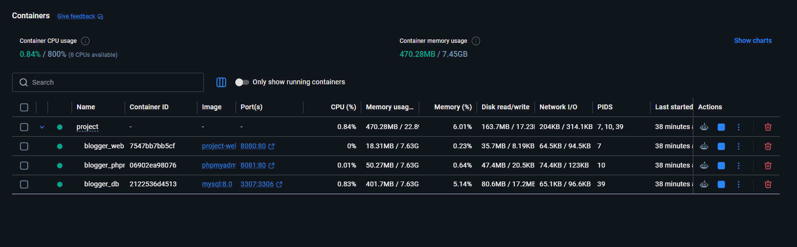

# 🚀 Инструкция по развёртыванию (Docker)

## Содержание

1. [Требования к серверу](#требования-к-серверу)
2. [Способ: Docker (рекомендуемый)](#способ-docker)
3. [Резервное копирование](#резервное-копирование)
4. [Устранение неполадок](#устранение-неполадок)

---
## Требования к серверу

| Компонент | Минимальная версия | Рекомендуемая версия |
|-----------|-------------------|---------------------|
| **Docker** | 20.10+ | 24.0+ |
| **Docker Compose** | 2.0+ | 2.20+ |
| **Оперативная память** | 2 GB | 4 GB |
| **Дисковое пространство** | 5 GB | 10 GB |
| **Операционная система** | Linux / Windows 10+ / macOS | Ubuntu 20.04+ / Windows 11 |

### Проверка требований

```bash
# Проверка версии Docker
docker --version
# Ожидаемый вывод: Docker version 24.0.6
# Проверка версии Docker Compose
docker compose version
# Ожидаемый вывод: Docker Compose version v2.20.2
```

## Способ docker

### Шаг 1: Установка Docker
Windows / macOS:
 1. Скачайте Docker Desktop с docker.com
 2. Установите и запустите
 3. Дождитесь зелёного индикатора "Engine running"


### Шаг 2: Клонирование репозитория
```bash
git clone https://github.com/r0de0-student/BloGGer-CenteR.git
cd BloGGer-CenteR/Project
```


### Шаг 3: Настройка переменных окружения
Файл docker-compose.yml уже содержит необходимые переменные:
```yaml
environment:
  - DB_HOST=db
  - DB_NAME=blogger_center
  - DB_USER=root
  - DB_PASS=root
```

### Шаг 4: Запуск приложения
```bash
# Первый запуск (сборка образов)
docker compose up -d --build
```

### Шаг 5: Проверка работы
```bash
# Первый запуск (сборка образов)
docker compose ps
```




### Шаг 6: Доступ к приложению

 - Веб-приложение: http://localhost:8080;
 - phpMyAdmin: http://localhost:8081;


### Шаг 7: Остановка приложения
```bash
# Остановка контейнеров (данные сохраняются)
docker compose down | stop 
```


## Резервное копирование

### Дамп базы данных: 
```bash
# Создать дамп
docker exec blogger_db mysqldump -u root -proot blogger_center > backup_$(date +%Y%m%d_%H%M%S).sql
# Восстановить из дампа
docker exec -i blogger_db mysql -u root -proot blogger_center < backup.sql
```


### Резервное копирование томов Docker:
```bash
# Список томов
docker volume ls
# Создание бэкапа тома
docker run --rm -v blogger_center_db_data:/source -v $(pwd):/backup alpine tar czf /backup/db_volume_backup.tar.gz -C /source .
# Восстановление тома
docker run --rm -v blogger_center_db_data:/target -v $(pwd):/backup alpine tar xzf /backup/db_volume_backup.tar.gz -C /target
```

### Пример скрипта backup_script.sh:
```bash
#!/bin/bash
BACKUP_DIR="/backups"
DATE=$(date +%Y%m%d_%H%M%S)
# Дамп БД
docker exec blogger_db mysqldump -u root -proot blogger_center > $BACKUP_DIR/db_$DATE.sql
# Архив проекта
tar -czf $BACKUP_DIR/project_$DATE.tar.gz \
    --exclude='vendor' \
    --exclude='node_modules' \
    --exclude='.git' \
    /path/to/Project
# Удаление старых бэкапов (старше 30 дней)
find $BACKUP_DIR -type f -mtime +30 -delete
```


## Устранение неполадок

1. Порт 8080 уже занят
```yaml
ports:
  - "8082:80"   # вместо 8080
```

2. MySQL не стартует
```bash
# Очистить тома и пересоздать
docker compose down -v
docker compose up -d --build
```

3. Oшибка подключения к БД в Docker
```php
$host = getenv('DB_HOST') ?: 'localhost';
$user = getenv('DB_USER') ?: 'root';
$pass = getenv('DB_PASS') ?: '';
```

4. Mедленная работа Docker на Windows
Решение: Включите WSL2 в настройках Docker Desktop:
1.Откройте Docker Desktop → Settings
2.Выберите Resources → WSL Integration
3.Включите интеграцию с вашим дистрибутивом WSL


#### Чек-лист успешного развёртывания
    - Docker Desktop запущен (зелёный индикатор)
    - Контейнеры успешно запущены (docker compose ps показывает "Up")
    - Приложение открывается в браузере (http://localhost:8080)
    - phpMyAdmin открывается (http://localhost:8081)
    - База данных содержит таблицы (users, blogs, posts, comments)
    - Тестовые аккаунты работают (admin@blog.com / password)
    - Статьи отображаются на главной странице
    - Комментарии работают


### Контакты
При возникновении вопросов обращайтесь к разработчику:

Автор: Гармонов Родион Андреевич (ПИб-242)

GitHub: r0de0-student

---

*Документация актуальна для версии 1.0.0*