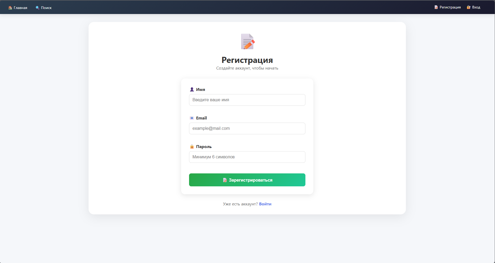
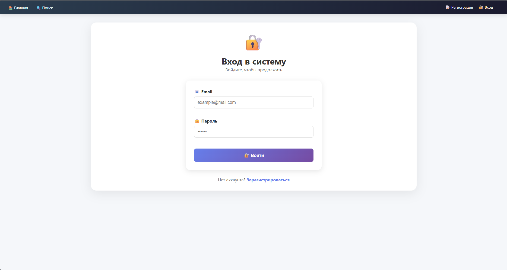
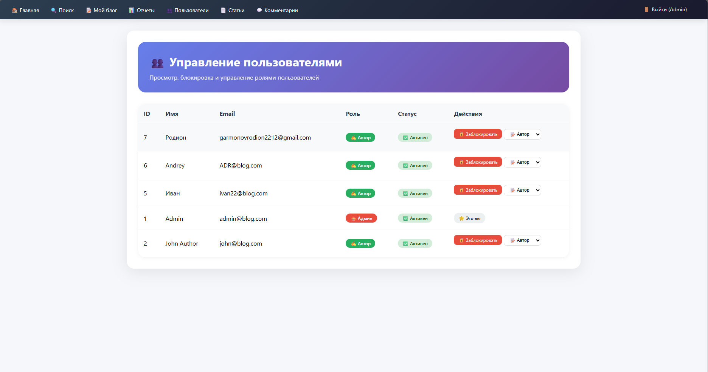
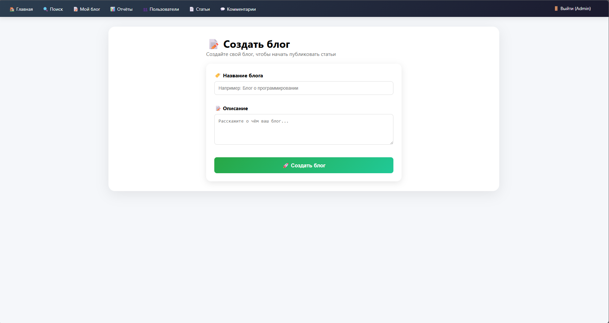
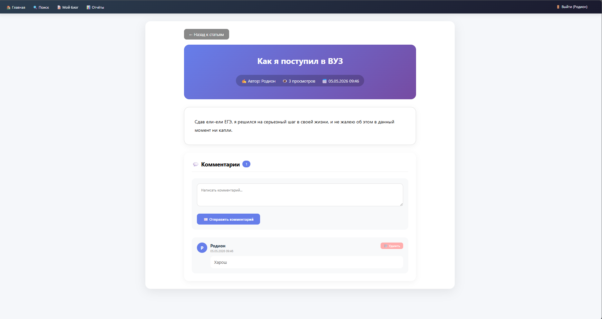

# 📖 Руководство пользователя

## Назначение и аудитория

**BloGGing CenteR** — это веб-платформа, созданная для тех, кто хочет делиться своими мыслями, идеями и опытом через блоги. Проект ориентирован на качественный текстовый контент, с поиском нужной вам информацией или для простого интереса от изучения чего то нового до обычного общения с другими пользователями.

### Целевая аудитория

| Роль | Описание |
|------|----------|
| **Администратор** | Управляет пользователями и модерирует контент |
| **Автор** | Создаёт блоги, публикует и редактирует статьи, может писать комментарии |

---

## Регистрация и вход

### Регистрация нового пользователя

1. На главной странице нажмите кнопку **"Регистрация"** в правом верхнем углу

2. Заполните форму регистрации:
   - **Имя** — ваше отображаемое имя
   - **Email** — адрес электронной почты (будет использоваться для входа)
   - **Пароль** — придумайте надёжный пароль

3. Нажмите кнопку **"Зарегистрироваться"**

После успешной регистрации вы автоматически получаете роль **Автор** и будете перенаправлены на страницу входа.

### Вход в систему

1. На главной странице нажмите кнопку **"Вход"**

2. Введите:
   - **Email** — адрес, указанный при регистрации
   - **Пароль** — ваш пароль

3. Нажмите **"Войти"**

---

## Описание ролей

### 👑 Администратор

Администратор имеет полный доступ к системе:

- Просмотр всех пользователей
- Блокировка и разблокировка пользователей
- Изменение ролей пользователей
- Удаление любых статей
- Удаление любых комментариев

### ✍️ Автор

Автор может:

- Создавать и настраивать свой блог
- Публиковать новые статьи
- Редактировать свои статьи
- Удалять свои статьи
- Удалять комментарии под своими статьями
- Просматривать статистику блога
- Просматривать все статьи на главной странице
- Читать полные версии статей
- Искать статьи по ключевым словам
- Оставлять комментарии (после входа)

---

## Основные сценарии работы

### Для автора

#### Создание блога

1. После входа нажмите **"Мой блог"** в навигационном меню
2. Нажмите кнопку **"Создать блог"**

3. Заполните поля:
   - **Название блога** — например, "Мой технический блог"
   - **Описание** — кратко о чём ваш блог

4. Нажмите **"Сохранить"**

#### Публикация статьи

1. В разделе **"Мой блог"** нажмите **"Новая статья"**

2. Заполните:
   - **Заголовок** — привлекающий внимание
   - **Содержание** — основной текст статьи

3. Нажмите **"Опубликовать"**

#### Редактирование статьи

1. Перейдите в **"Мой блог"**
2. Найдите нужную статью в списке
3. Нажмите кнопку **"Редактировать"** ✏️
4. Внесите изменения и нажмите **"Сохранить"**

#### Удаление статьи

1. В разделе **"Мой блог"** найдите статью
2. Нажмите кнопку **"Удалить"** 🗑️
3. Подтвердите действие

### Для читателя

#### Просмотр статей

1. На главной странице вы увидите список всех статей
2. Нажмите **"Читать далее"** или на заголовок статьи

#### Комментирование

1. Откройте любую статью
2. Прокрутите вниз до блока комментариев
3. Напишите комментарий в текстовое поле
4. Нажмите **"Отправить"**

### Для администратора

#### Блокировка пользователя

1. Перейдите в раздел **"Пользователи"** в навигации
2. Найдите нужного пользователя в таблице
3. Нажмите **"Заблокировать"** 🔒
4. Для разблокировки нажмите **"Разблокировать"** 🔓

#### Удаление статьи (модерация)

1. Перейдите в раздел **"Статьи"**
2. Найдите статью, нарушающую правила
3. Нажмите **"Удалить"** 🗑️

#### Удаление комментария

1. Перейдите в раздел **"Комментарии"**
2. Найдите нежелательный комментарий
3. Нажмите **"Удалить"**

---

## Часто задаваемые вопросы (FAQ)

### ❓ Как восстановить пароль?

В текущей версии для восстановления пароля необходимо обратиться к администратору.

### ❓ Почему я не могу удалить комментарий?

Права на удаление комментария есть только у:
- Автора комментария
- Автора статьи, под которой оставлен комментарий
- Администратора

### ❓ Как стать автором?

При регистрации каждый пользователь автоматически получает роль **Автор**.

### ❓ Где найти админ-панель?

Ссылки на админ-панель появляются в навигации только после входа под учётной записью с ролью **admin**.

### ❓ Могу ли я редактировать чужую статью?

Нет, редактировать статьи могут только их авторы и администраторы.

### ❓ Что такое подписка на блог?

Подписка позволяет отслеживать новые статьи из выбранного блога в ленте новостей.

### ❓ Как удалить свой аккаунт?

Для удаления аккаунта обратитесь к администратору.

### ❓ Безопасны ли мои данные?

Да, все пароли хэшируются с помощью bcrypt, а приложение защищено от SQL-инъекций и XSS-атак.

---

## Контакты поддержки

При возникновении проблем или вопросов обращайтесь к администратору.

---

*Документация актуальна для версии 1.0.0*